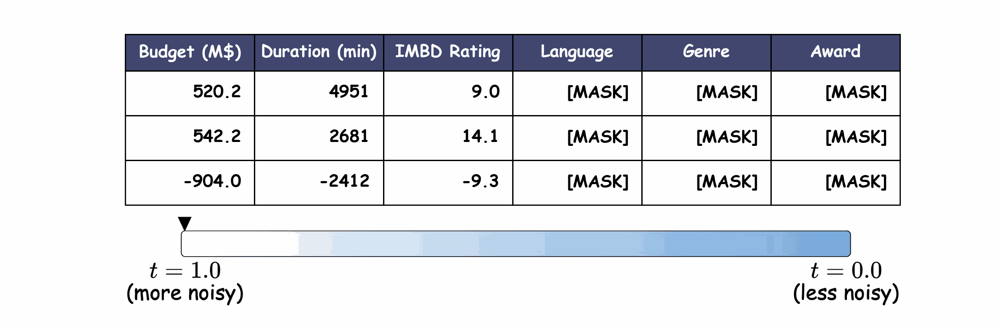
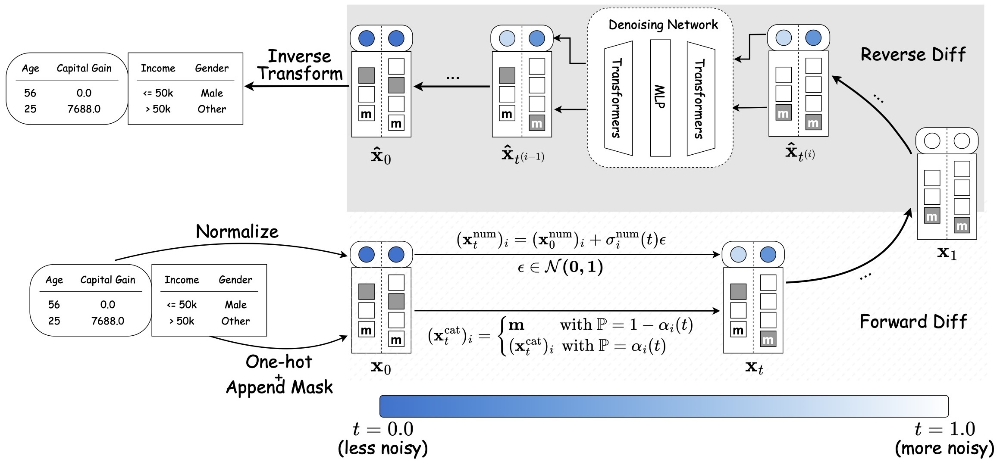

# TabDiff: a Multi-Modal Diffusion Model for Tabular Data Generation

  
  <!--  -->
  

  
  
<em>Figure 1: Visualing the generative process of TabDiff. A high-quality version of this video can be found at <a href="images/tabdiff_demo.mp4" download>tabdiff_demo.mp4</a></em>

This repository provides the official implementation of the paper "TabDiff: a Multi-Modal Diffusion Model for Tabular Data Generation".

## Latest Update

- [2024.10]：Our code is at the final stage of cleaning up. Please check back soon for its release!

## Introduction

  
  
<em>Figure 2: The high-level schema of TabDiff</a></em>

TabDiff is a unified diffusion framework designed to model all muti-modal distributions of tabular data in a single model. Its key innovations include:  

1) Framing the joint diffusion process in continuous time,
2) A feature-wised learnable diffusion process that offsets the heterogeneity across different feature distributions,
3) Classifier-free guidance conditional generation for missing column value imputation. 

The schema of TabDiff is presented in the figure above. For more details, please refer to [our paper](https://arxiv.org/abs/2410.20626).

